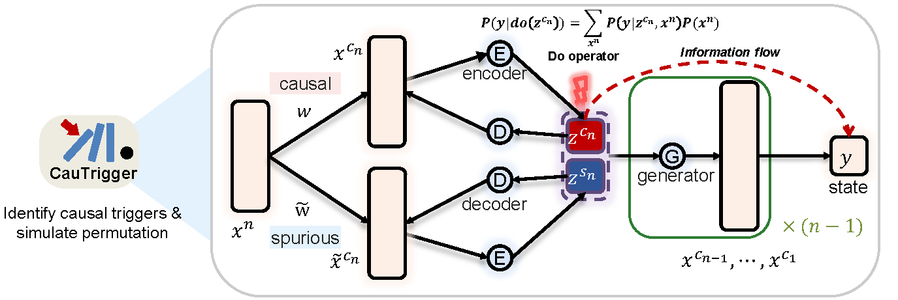

# CauTrigger

[![Tests][badge-tests]][tests]
[![Documentation][badge-docs]][documentation]


[badge-tests]: https://img.shields.io/github/actions/workflow/status/ChengmingZhang-CAS/CauTrigger/test.yaml?branch=main
[badge-docs]: https://img.shields.io/readthedocs/CauTrigger

<p align="center">
  <strong>Deciphering biological system state transitions by hierarchical causal decomposition</strong>
</p>

<div align="center">
  
</div>

> <small>
Causal decoupling model constructed on a dual-flow variational autoencoder (DFVAE) framework to identify causal triggers influencing state transition. Triggers ($x^n$) are processed through a feature selection layer to separates causal triggers ($x^{c_n}$) and others ($\tilde{x}^{c_n}$ ), and then encoded them into latent space $z$ consists of causal ($z^{c_n}$) and spurious ($z^{s_n}$) components. This latent space is decoded to generate downstream conductors ($x^{c_{n-1}},...,x^{c_1}$) and to predict the final cell state ($y$). The model strives to maximize the causal information flow, $I(z^{c_n}→y)$, from $z^{c_n}$ to $y$, thus delineating the causal path from $x^{c_n}$ to $y$ via $z^{c_n}$.
> </small>
---

## Getting started

Please refer to the [documentation][],
in particular, the [API documentation][].

## Installation

You need to have Python 3.10 or newer installed on your system.
If you don't have Python installed, we recommend installing [uv][].

There are several alternative options to install CauTrigger:

<!--
1) Install the latest release of `CauTrigger` from [PyPI][]:

```bash
pip install CauTrigger
```
-->

1. Install the latest development version:

```bash
pip install git+https://github.com/ChengmingZhang-CAS/CauTrigger.git@main
```

## Release notes

See the [changelog][].

## Contact

For questions and help requests, you can reach out in the [scverse discourse][].
If you found a bug, please use the [issue tracker][].

## Citation

> t.b.a

[uv]: https://github.com/astral-sh/uv
[scverse discourse]: https://discourse.scverse.org/
[issue tracker]: https://github.com/ChengmingZhang-CAS/CauTrigger/issues
[tests]: https://github.com/ChengmingZhang-CAS/CauTrigger/actions/workflows/test.yaml
[documentation]: https://cautrigger.readthedocs.io
[changelog]: https://cautrigger.readthedocs.io/en/latest/changelog.html
[api documentation]: https://cautrigger.readthedocs.io/en/latest/api.html
[pypi]: https://pypi.org/project/CauTrigger
